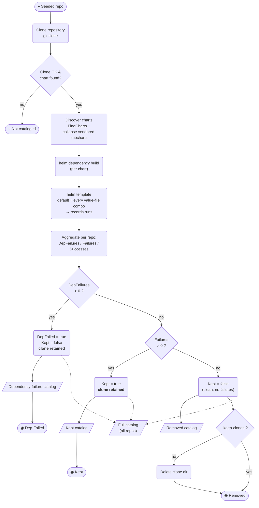

# Helm Fetcher — per-repo keep / drop classification (BPMN)

Process executed by `helm_fetcher` in `-mode=full`, once per seeded repository.
Classification logic: `main.go:287-302`; output split: `exporter/exporter.go:66-69`.
(Vector version: `fetcher_repo_classification_bpmn.svg`.)

## Reading it

- **Exclusive gateways (diamonds)** are evaluated top-down; the **dep-failure test runs first**, so a repo is bucketed `Dep-Failed` as soon as *any* chart fails `helm dependency build` — even if its other charts templated successfully (e.g. a monorepo).
- **Data objects** (`/…/`) are the output catalogs. Every repo — dep-failed, kept, or removed — is also written to the **full catalog** (dotted flows), which is the authoritative record of all repos.
- **Clone lifecycle:** only the *clean* branch may delete the clone (and only when `-keep-clones=false`). Dep-failed and template-failed clones are always retained.
